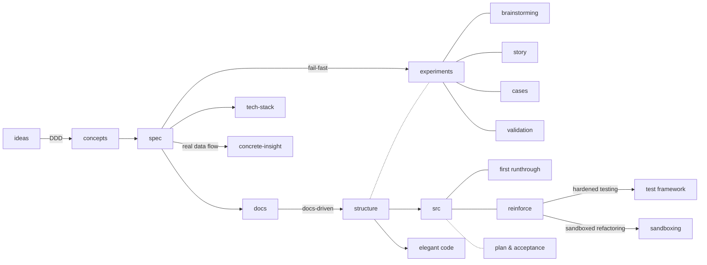

# VISION — sap-skills

English | [中文](VISION.zh.md)

This document explains why sap-skills exists. For usage and installation, see [`README.md`](README.md).

[No Silver Bullet](https://en.wikipedia.org/wiki/No_Silver_Bullet) (Fred Brooks, 1986) points out that software complexity comes in two kinds:

- **essential complexity** (inherent to the problem itself)
- **accidental complexity** (introduced by the way we implement it)

Agents have already solved most of the accidental complexity for us — but essential complexity will not disappear as models get smarter.

So I designed SAP to organize the essential complexity of software by layers.

## Stage design

Align the **domain model** and its description with the AI. In concepts, use an **examples × concepts matrix** so the domain model and real stories validate each other.

After the concept phase, confirm the tech stack and directory structure, and write a minimal spec — that is when the tone is set.

**fail-fast** (surface errors early) — make failures visible the moment they happen, instead of masked or delayed. It shows up in two places:

1. **Concretization**: seeing the actual data path directly is more effective, so right after spec1, have the agent generate a `concrete-insight.md` that shows the real data flow.
2. **Experiments**: for the hard parts, use experiments to prove them out in code ahead of time. Leverage the agent's one-shot ability: set up strict automated tests, or build a quick prototype. The `/prototype` skill from mattpocock is a good reference here.

On experiments:

- An experiment should ideally be something the agent can evaluate by itself — there should be an expectation set before the experiment.
- Overly boilerplate content (e.g. experiments on a stable framework, or things with existing references on GitHub) does not need an experiment.

Experiments sit before the real src (full coding). They absorb blast radius and uncertainty: when the agent runs experiments, you don't need to manage how many dirty commits the process produced — when integrating, just take the final result.

Phase two of spec: prepare development with a **docs-driven** approach.

Why not spec-driven?

A single spec file cannot carry that many decisions. The spec's responsibility is abstracted to: tech stack, folder hierarchy (including boundary separation of where code lives), and technology selection decisions.

## Skills

Combined with mattpocock skills, quality at each stage of development is ensured. The common ones:

- Alignment → /grill-me
- Handoff → /to-handoff, /to-ticket
- Feedback → /tdd, /code-review

To solidify the process, I also added some helper skills:

- goals-gate-approver: generates a `user-goals.md` record, one constraint per line; constraints steer the agent toward better plans
- plan-analysis-matrix: align on pain points with the agent first, then generate a comparison of plans with different characteristics, for the selection stage
- report-from-websearch: format spec for writing reports — citations and format constrain the agent to produce quality search reports, usually used with a subagent
- structure-design: collects official scaffolds and recommended directory structures; uses exclusions to steer the agent away from low-grade structures like flat layouts

Finding a good plan takes trade-offs. The current solution space is like a **high-dimensional convex hull**; the constraints and plan-comparison skills behave like a linear-programming solver.

## References

- DDD: [Domain-Driven Design: Tackling Complexity in the Heart of Software](https://www.amazon.co.uk/Domain-Driven-Design-Tackling-Complexity-Software/dp/0321125215) (Eric Evans, 2003)
- docs-driven: [Docs-Driven Development Is Half-Right](https://docsio.co/blog/docs-driven-development)
- blast radius: [Just Talk to It](https://steipete.me/posts/just-talk-to-it/) by steipete (author of OpenClaw)
