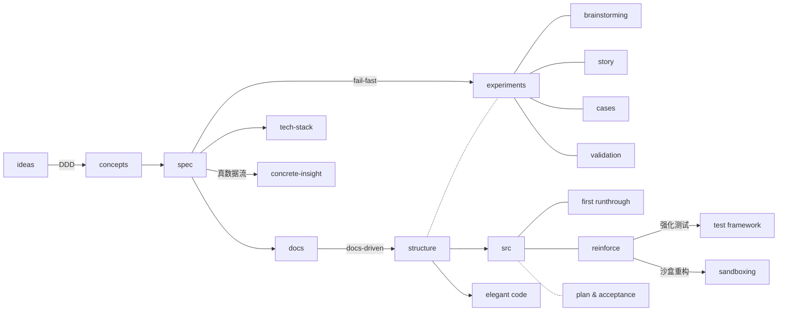

# VISION — sap-skills

本文档说明 sap-skills 为什么存在。使用与安装见 [`README.md`](README.md)。

[No Silver Bullet](https://en.wikipedia.org/wiki/No_Silver_Bullet)（Fred Brooks，1986）指出，软件开发的复杂性分为两类：

- **essential complexity**（本质复杂度，问题本身固有的）
- **accidental complexity**（偶然复杂度，实现方式带来的）

Agent 已经帮我们解决了大部分偶然复杂度问题，但是本质复杂度并不会随着智能的提升而彻底被解决。

面对这个问题，我设计 SAP 来将软件本质的复杂性按层级归纳。

## 阶段设计

**领域模型** 和AI对齐领域模型描述。在concept中使用**例子x概念矩阵**，来确保领域模型和真实故事的互相验证。

概念过程结束后，确认技术栈和目录结构，完成一个最薄的 spec，此时才定下基调。

**fail-fast**（尽早暴露错误）——让失败在发生时立即显现，而不是被掩盖/延迟，体现在两点：

1. **具体化**：直接看到数据链路，是更有效的，所以在 spec1 之后，需要让 agent 生成一个 concrete-insight.md，展示真实数据流。
2. **实验**：对于困难的部分用实验提前进行编码实战检验。发挥 agent 的 one-shot 能力，设立严格的自动化测试，或者快速原型。 这里也可参考 mattpocock 的 /prototype skill

关于实验的说明：
- 实验应该最好是能让 agent 自己评估的，在实验之前应该有一个预期。
- 对于太过样板的内容（比如稳定框架上的试验，或者github有现成参考），不需要实验。

实验设置在正式 src（完整编码）之前。实验可以分摊 blast radius 和未知性，当agent做出实验，不需要管理他实验过程的提交有多少 dirty 尝试，在整合时只需要汲取它最后的结果即可。

spec 第二阶段：用 docs-driven 的形式做开发项目的准备。

Why not spec-driven？

一个spec文件无法承载过多决定，spec的职责抽象为：技术栈，文件夹层级（包括代码位置的边界划分），技术选型决策。

## Skills

结合 mattpocock skills，可以保证开发各阶段的质量。 常用的有：

- 对齐 → /grill-me
- 交接 → /to-handoff, /to-ticket
- 反馈 → /tdd, /code-review

另外，为了固化流程，我增加了一些辅助 skill：

- goals-gate-approver：生成 user-goals.md 记录，每行一条约束，约束控制 agent 给出更好计划
- plan-analysis-matrix：先和 agent 对齐痛点，然后生成特性各异方案对比，选型时用
- report-from-websearch：编写报告的格式规范，用引用和格式来限制 agent 产出优秀搜索报告，通常用 subagent 配合此 skill
- structure-design：集合多种官方脚手架和推荐目录结构，使用排除避免 agent 生成平铺等低级结构的倾向

找到一个好方案需要 trade-off，当前已有的求解域，就类似一个**高维凸包**，约束和方案对比 skill 比较像线性规划求解器。

## 参考

- DDD：[Domain-Driven Design: Tackling Complexity in the Heart of Software](https://www.amazon.co.uk/Domain-Driven-Design-Tackling-Complexity-Software/dp/0321125215)（Eric Evans，2003）
- docs-driven：[Docs-Driven Development Is Half-Right](https://docsio.co/blog/docs-driven-development)
- blast radius：[Just Talk to It](https://steipete.me/posts/just-talk-to-it/) steipete（OpenClaw 作者）
